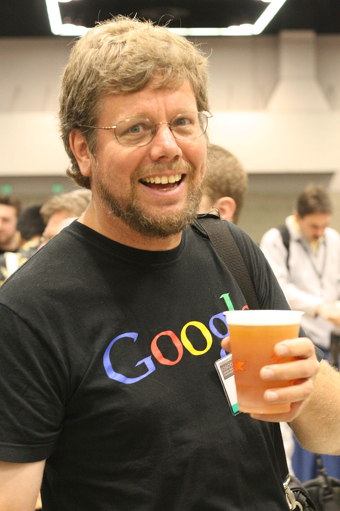

---
hide:
  - navigation
  - toc
---

# Scientific Programming: An Introduction

These lecture notes, still a work in progress, are for a course taught at SJTU to Math undergraduate students.

## What This Lecture Is Not About

* Computer theory
* The inner workings of programming
* Specific programming methodologies (procedural, functional, OO, etc.)
* Algorithm complexity theory

## Intended Audience

* Individuals with little to no programming experience
* Basic calculus and algebra are sufficient; being a math wizard is not necessary
* A mathematical perspective is emphasized but not mandatory
* Those interested in understanding programming fundamentals over technicalities
* Aspiring scientific computation implementers
* Individuals seeking to manage data systematically

## Learning Outcomes

By the end of this course, you should be able to:

* Perform scientific computations (optimization, integration, dynamical systems, Monte Carlo simulations, some ML, etc.)
* Efficiently organize, clean, and query data
* Debug and optimize your code
* Plan and execute complex projects with appropriate tools and architecture

## Python as the Primary Language

We use [Python](https://www.python.org/) for its:

### Natural Syntax

Comparing C++:

```c++
#include <iostream>
int main()
{
    std::cout << "Hello world" << std::endl;
}
```

With Python:

```python
print("Hello world")
```

As mathematicians it is also a language that is close to the colloquial mathematical formalism: **write less, express more conceptually**.

### Portability

* Python is an interpreted language, allowing for immediate execution and rapid prototyping, although with potential trade-offs if misused.
* Code is cross-platform compatible (Linux, macOS, Windows, Android, iOS, etc.) without needing recompilation.

### Versatility

* Supports various programming paradigms (object-oriented, functional)
* Suitable for data analysis, automation, machine learning, web development, API deployment, etc.
* Facilitates interaction with other programming languages
* Strikes a balance between low-level and high-level programming

### Extensive Community Support

* Among the top 3 most utilized programming languages
* Preferred for data analysis, machine learning, AI
* Rich ecosystem of well-maintained, open-source libraries, including but not limited to:
    * `numpy`, `pandas` for data manipulation
    * `scipy`, `statsmodels` for scientific computing
    * `matplotlib`, `seaborn` for visualization
    * `pytorch`, `tensorflow` for machine learning and AI
* Highly active on GitHub, unlike Matlab

### Job Market Demand

Familiarity with Python and related libraries is increasingly a prerequisite in various fields, replacing basic requirements like Excel proficiency from years past.


### **OPEN SOURCE**

Python was created by [Guido van Rossum](https://en.wikipedia.org/wiki/Guido_van_Rossum) who released it and maintained it for over 30 years as open-source project.
This fostered a global community of contributors ensuring transparency, reliability through constant auditing process, and huge diversity of the ecosystem.



