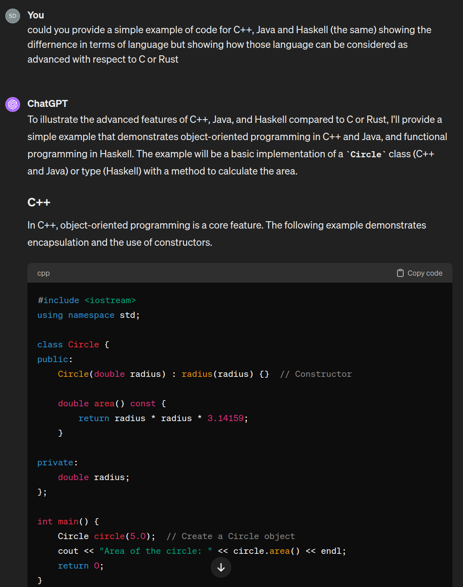

# Introduction


## About Computing Something

Our goal, from a scientific simplistic viewpoint, is to perform the following 


$$
\begin{equation}
x \longmapsto f(x)
\end{equation}
$$

In other terms, given an input $x$ we want to transform it into an output $f(x)$.


!!! example "Examples"
    * A constant function $f$ printing `Hello World`: 

        $$x \longmapsto \text{``Hello World!''}$$
    
    * A function computing the exponential of $x$:

        $$x \longmapsto e^x$$

    * A function $f$ computing the expectation of a random variable $X$ with Monte-Carlo

        $$X \longmapsto \frac{1}{N} \sum_{k=1}^N x_k, \quad x_k \text{ independently drawn from }\mathcal{L}aw(X)$$
        
    * etc.

Defining, using, composing functions is natural for mathematicians.
Yet, the question is whether it is possible to design a machine that will accomplish this task and return the output.
The idea of such machines dates back centuries ago, primarily performing basic arithmetic such as finger counting.
They were of mechanical nature such as *abacus*, *suanpan (算盘)*, *Pascaline* or various compass and astronomical devices.

Many evolutions happened during the 19th and beginning of 20th century, but the first real modern version of a computer how we know now was done by *[Konrad Suze](https://en.wikipedia.org/wiki/Konrad_Zuse)* around 1939-40.
He designed a computer using electric signals (with vacuum tubes) rapidly followed by the works of [Alan Turing](https://en.wikipedia.org/wiki/Alan_Turing) or [John von Neumann](https://en.wikipedia.org/wiki/John_von_Neumann).

Note that this period coincides with an intense work in the mathematical community about the foundations of mathematics.
Without entering into the history of computers and their inner functioning, let us notice the following.
Mathematics starts with logic, axiomatic set theory, then proceeds to the building of natural numbers $\mathbb{N}$, rational numbers $\mathbb{Q}$, real numbers $\mathbb{R}$, vector spaces, manifolds, etc. and functions on each of these spaces.

If one wants to perform computations in a mathematical sense, one would need those elements.
Starting with a simple two elements logical Boolean Algebra `{True, False}`, it holds 

* Or: `True or True = True`, `True or False = True`, `False or False = False`
* And: `True and True = True`, `True and False = False`, `False and False = False`
* Negation: `~True = False`, `~False = True`

??? note "Boolean algebra or set theoretical viewpoint"
    This can be written in terms of

    * $X = \{0,1\}$ boolean algebra as $1 + 1 = 1$ where $1$ stands for `True` and $+$ for `or`. Same for $0$ standing for `False`, $*$ for `and`.
    * $X = 2^{\emptyset}=\{\emptyset, \{\emptyset\}\}$ as $\{\emptyset\}\cup \{\emptyset\} = \{\emptyset\}$ where $\{\emptyset\}$ stands for `1` and $\cup$ for `or`. Similarly $\emptyset$ stands for $0$, $\cap$ stands for `and` and the complement ${}^c$ stands for `~`.

Starting with these premises, following John von Neumann's method, one can *within ZF theory* construct natural numbers, and from there integers, rational numbers etc.
At least build a finite arithmetic.

Hence for a computer to work, one needs in the first place

1. A $0$ and $1$ (or `False/True` states)
2. The operations `or`, `and` and `~`
3. A way to read the input and output of those operations (1)
{ .annotate }

    1.  :point_right: This part is for instance one of the challenges in quantum computing.

As for the $0$, $1$, the invention of electricity allows to produce and measure presence of current (or absence thereof).
As for the operations, they are derived from the invention of so called **transistors** that can generate **gates** performing those [operations](http://hyperphysics.phy-astr.gsu.edu/hbase/Electronic/trangate.html).

The first attempts tried to get it working in a decimal world.
However from this setting it is more natural, efficient and less error prone for a computer to work in base 2 as it is closer to what the circuitry allows, and since mathematically it does not matter what base is used, binary it be.

## Talking to a Machine

The machine can now deal with finite arithmetic, in other terms, we can do simple $x \mapsto f(x)$.
However, it remains complicated to *explain* to this machine

* what $x$ (the input) is. (Convert into binary sequences)
* how it shall transform $x$ into $f(x)$ with such basic operations
* how to read out the output (for instance from binary to decimal and print it on a screen or record it somewhere)

This is where programming languages come into place.
Like any language, they are [characterized by a syntax (form) and semantics (meaning)](https://en.wikipedia.org/wiki/Programming_language).
One receiving end is the computer with a very rudimentary form (made of 0/1 and operations on it), while the other is a human with sophisticated one.
Hence programming languages are often classified from **low level** (close to the machine language) to **high level** (close to human language).
Here is a personal ranking of programing languages along this dimension

* **(Extremely) Low level:**
    Those languages are the closest to the machine code instructions.
    They are extremely efficient as there is no overhead between the instructions and the computer.
    However, beyond simple but critical operations, it is virtually impossible to express more complex framework in reasonable amount of time.
    Classical example of which is the [assembly language](https://en.wikipedia.org/wiki/Assembly_language) (before it was even punching cards).
    Current applications are rare but very specific (flight instruments, rockets, cryptography, special algorithm).
    ```assembly title="Example of assembly language"
    Example:  M  ADD  R1, ='3'
    where, M - Label; ADD - symbolic opcode; 
    R1 - symbolic register operand; (='3') - Literal
    
    Assembly Program:
    Label  Op-code   operand   LC value(Location counter)
    JOHN   START     200
           MOVER     R1, ='3'    200
           MOVEM     R1, X       201
    L1     MOVER     R2, ='2'    202
           LTORG                 203
    X      DS        1           204
           END                   205
    
    ```

* **Low level:** 
    Those programming languages are also of procedural nature but with a more natural syntax and semantic with advanced multipurpose functionalities (control flows, recursion, functions, or advanced data structure).
    They remain close enough to the machine to be very efficient. 
    They do not allow for higher level concepts (templating, objects, etc) and require care how to handle memory.
    Typical examples are `FORTRAN`, `C` or more recently `Rust`, `CUDA`.
    They are still very widely used as they are the backbones of many infrastructures and operating system (Linux for instance) as well as scientific libraries.

    === "Fortran"
    
        ```fortran
        program fibonacci
            implicit none
            integer :: n, i
            integer, allocatable :: fib(:)
        
            print *, 'Enter the number of terms:'
            read *, n
        
            allocate(fib(n))
        
            fib(1) = 0
            if (n > 1) fib(2) = 1
        
            do i = 3, n
                fib(i) = fib(i-1) + fib(i-2)
            end do
        
            print *, 'Fibonacci sequence:'
            do i = 1, n
                print *, fib(i)
            end do
        
            deallocate(fib)
        end program fibonacci
        ```
    
    === "C"
    
        ```c
        #include <stdio.h>
        
        void fibonacci(int n) {
            int t1 = 0, t2 = 1, nextTerm;
        
            for (int i = 1; i <= n; ++i) {
                printf("%d, ", t1);
                nextTerm = t1 + t2;
                t1 = t2;
                t2 = nextTerm;
            }
        }
        
        int main() {
            int n;
            printf("Enter the number of terms: ");
            scanf("%d", &n);
            printf("Fibonacci Sequence: ");
            fibonacci(n);
            return 0;
        }
        ```
    === "Rust"
        ```rust
        fn fibonacci(n: u32) -> u32 {
            let (mut a, mut b) = (0, 1);
            for _ in 0..n {
                let temp = a;
                a = b;
                b = temp + b;
            }
            a
        }
        
        fn main() {
            let n = 10; // Example: first 10 Fibonacci numbers
            for i in 0..n {
                println!("{}", fibonacci(i));
            }
        }
        ```

* **Medium level**: 
    With more complex needs and larger projects, languages have been extended in terms of functionalities such as memory management, object oriented or functional programming.
    On the one hand, they often remove many difficulties related to lower level languages such as addressing and managing the memory, implement asynchronous or parallel programming, and make use of objects or more abstract structures.
    They are tons of such languages with each its own philosophy.
    Most widely known are `C++`, `Java`, `Haskell` (functional programming language), `JavaScript` (web oriented), etc.
    They are still very efficient and used in infrastructure or many web related applications.

    === "C++"
        ```cpp
        #include <iostream>
        using namespace std;
        
        class Circle {
        public:
            Circle(double radius) : radius(radius) {}  // Constructor
        
            double area() const {
                return radius * radius * 3.14159;
            }
        
        private:
            double radius;
        };
        
        int main() {
            Circle circle(5.0);  // Create a Circle object
            cout << "Area of the circle: " << circle.area() << endl;
            return 0;
        }
        ```
    === "Java"
        ```java

        public class Circle {
            private double radius;
        
            public Circle(double radius) {
                this.radius = radius;
            }
        
            public double area() {
                return radius * radius * Math.PI;
            }
        
            public static void main(String[] args) {
                Circle circle = new Circle(5.0);
                System.out.println("Area of the circle: " + circle.area());
            }
        }
        ```
    === "Haskell"
        ```haskell
        data Circle = Circle Double  -- Circle type with a single constructor
        
        area :: Circle -> Double
        area (Circle radius) = pi * radius ^ 2
        
        main :: IO ()
        main = print $ area $ Circle 5.0
        ```

* **Higher level**:
    Those programming language takes the previous level type but focus on simplifying the syntax and semantics, removing lot of the compilation/debugging work as well as static typing requirements (specifying the nature of all variable before use).
    They are also by definition very dynamic (objects can be declared at running time) and interpreted (scripting language).
    Paramount example of which is `Python` but also `Lua`, `Ruby`, etc.
    They are also programming languages with specific application at hand such as `R`, `Matlab`, `Mathematica`.

    === "Python"
        ```py
        import numpy as np
        
        # Define an array of numbers
        data = np.array([1, 2, 3, 4, 5])
        
        # Calculate the mean and standard deviation
        mean = np.mean(data)
        std_dev = np.std(data)
        
        print("Mean:", mean)
        print("Standard Deviation:", std_dev)
        ```
    === "R"
        ```r
        # Define a vector of numbers
        data <- c(1, 2, 3, 4, 5)
        
        # Calculate the mean and standard deviation
        mean <- mean(data)
        std_dev <- sd(data)
        
        print(paste("Mean:", mean))
        print(paste("Standard Deviation:", std_dev))
        ```
    === "Matlab"
        ```matlab
        % Define an array of numbers
        data = [1, 2, 3, 4, 5];
        
        % Calculate the mean and standard deviation
        mean_val = mean(data);
        std_dev = std(data);
        
        disp(['Mean: ', num2str(mean_val)])
        disp(['Standard Deviation: ', num2str(std_dev)])
        ```

* **(Extremely) high level**:
    `ChatGPT`.
    This is not really a programming language but as a large language model it can perform the task of converting natural language into code.
    More advanced models such as [AlphaDev](https://deepmind.google/discover/blog/alphadev-discovers-faster-sorting-algorithms/) from google deepmind code are trained to design algorithm that are more efficient than those written by human beings.
    

As you can see, `ChatGPT`, or any other LLM, is a game changer on how we approach programming languages. 

**So why shall we learn a programming language?**

Well the answer is two fold.
Learning a specific programming language indeed does not make much sense anymore.
However learning the foundations of a programming language is important to understand how a machine is generating output, how to design programs and then ask any AI to help you along the way.
